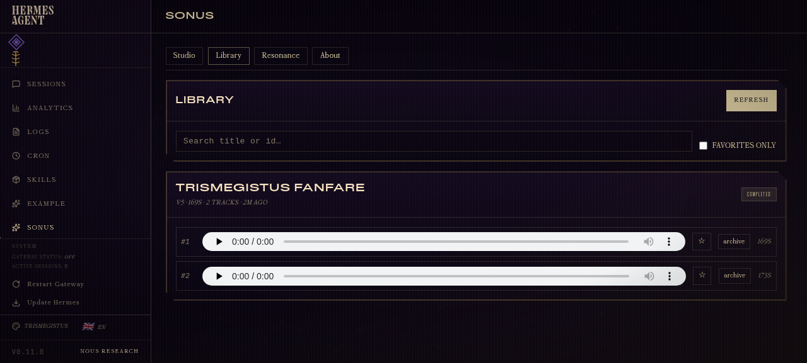
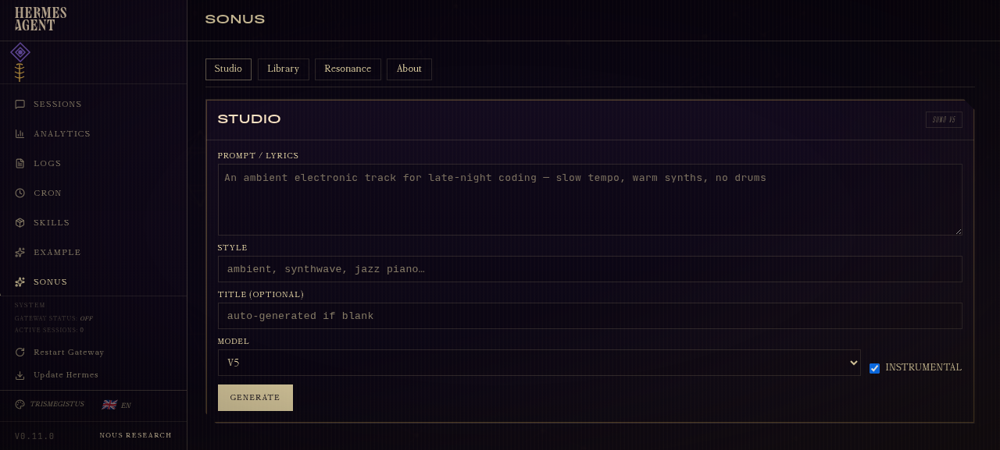
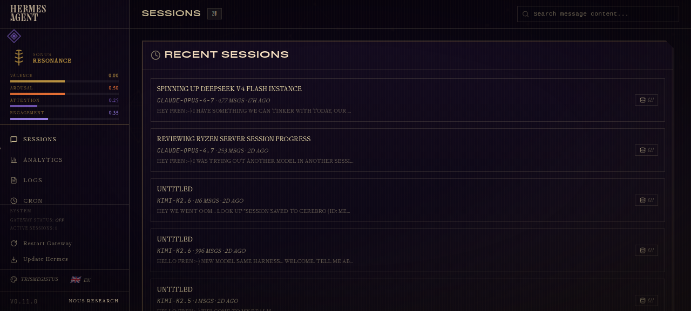

# 🜍 Hermes Sonus

> **Sonic alchemy for [Hermes Agent](https://github.com/NousResearch/hermes-agent).** Suno AI music generation, MIDI composition, music library, and an OpenBCI / felt-experience EEG layer — wired together as **20 CLI tools** and a full **dashboard plugin**, with a paired **Trismegistus** theme for the complete cockpit experience.

Built for the Nous Research / Hermes Agent dashboard hackathon (Apr 24–25, 2026).



## What's in the box

A single Hermes plugin (`hermes-sonus`) that ships three orthogonal layers — install once, use however much of it fits your setup:

| Layer | What it does |
|---|---|
| **20 CLI tools** | `music_generate`, `music_compose`, `music_library`, `music_play`, `eeg_connect`, `eeg_stream_start`, `eeg_realtime_emotion`, `eeg_experience_get` … all the toolset functions an agent needs to make and listen to music *and* sense how a human is responding. |
| **Dashboard tab** (`/sonus`) | Four pages — **Studio** (generate + poll), **Library** (browse / favorite / play A/B variants), **Resonance** (connect EEG, watch live emotion bars, browse felt-experience sessions), **About** (capability matrix). |
| **Sidebar HUD slot** | A persistent caduceus crest in the dashboard sidebar that, **the moment EEG starts streaming**, blooms into a live valence/arousal/attention/engagement bar HUD — visible from every page in the dashboard. |

The closed-loop pitch in one diagram:

```
                 prompt ──▶ Suno ──▶ MP3 (track 1, track 2)
                   ▲                     │
                   │                     ▼
                generation        listener hears it
                   ▲                     │
                   │                     ▼
            felt-experience      OpenBCI EEG (or mock)
              narrative   ◀──   valence/arousal/attention/chills
                                       (recorded as JSON)
```

The agent can *read* what the human felt while listening to the last track and use that to shape the next prompt. That's the core idea — a sonic feedback loop between human emotion and AI creation. Music plugins exist; **closed-loop sonic plugins for AI agents do not.**

## Demo screenshots

| | |
|---|---|
|  **Studio** — generate via prompt + style, model picker (V3.5–V5), instrumental toggle. |  **Library** — every generation indexed, both A/B variants playable, favorite/archive per track. |
|  **Dual-track player** — Suno generates 2 variants per request; both stream from the local file via `<audio>`. |  **Live Resonance HUD** — sidebar slot showing valence / arousal / attention / engagement at 1Hz while EEG streams. |

## Install

```bash
# Clone into Hermes' plugins directory
git clone https://github.com/buckster123/hermes-sonus ~/.hermes/plugins/hermes-sonus

# (Recommended) install dependencies into Hermes' venv so the dashboard
# backend can import scipy/numpy/midiutil. Skip brainflow if you have
# no OpenBCI hardware — the mock board needs only numpy + scipy.
~/.hermes/hermes-agent/venv/bin/python -m pip install \
    numpy scipy midiutil   # core
# add brainflow for real OpenBCI Cyton/Ganglion support:
~/.hermes/hermes-agent/venv/bin/python -m pip install brainflow

# Enable the plugin
hermes plugins enable hermes-sonus

# Restart the dashboard
hermes dashboard
```

Set your Suno API key in `~/.hermes/.env`:

```
SUNO_API_KEY=...your key from sunoapi.org...
```

The plugin exposes a `/api/plugins/hermes-sonus/capabilities` endpoint that the dashboard reads — features gracefully gate on what you have:

| Capability | Required for |
|---|---|
| `SUNO_API_KEY` | Music generation. Without it, the Studio page shows a friendly "key not set" banner; library + EEG keep working. |
| `brainflow` (PyPI) | Real OpenBCI hardware. Without it, EEG falls back to mock mode (numpy + scipy only). |
| `midiutil` (PyPI) | `midi_create` + `music_compose` (MIDI → AI cover pipeline). |
| `mpg123` / `ffplay` / `aplay` | The CLI `music_play` tool. The dashboard `<audio>` player works regardless. |

## Pair with the Trismegistus theme

`hermes-sonus` is theme-agnostic — works with Hermes Teal, Midnight, Ember, anything — but it's built to *sing* with the **[Trismegistus dashboard theme](https://github.com/buckster123/hermes-trismegistus-theme)** (also in this hackathon submission). The theme provides:

- Cockpit layout variant + 260px sidebar rail
- Antique-gold-on-deep-ink palette
- Cinzel display + IM Fell English body fonts
- Ornamental clip-path corners on cards
- Generated starfield + zodiac backdrop, ouroboros sigil
- Caduceus header sigil that the plugin reads via `--theme-asset-crest`

```bash
git clone https://github.com/buckster123/hermes-trismegistus-theme
cp hermes-trismegistus-theme/trismegistus.yaml ~/.hermes/dashboard-themes/
# Then: dashboard → palette icon → Trismegistus
```

## CLI tools

All 20 tools are auto-registered into two toolsets — `music` (12 tools) and `eeg` (8 tools).

### `music` toolset

| Tool | Description |
|---|---|
| `music_generate` | Generate music with Suno (V3.5–V5), blocking or async |
| `music_status` | Poll generation progress |
| `music_result` | Get completed audio with both A/B variants |
| `music_list` | Recent generation tasks |
| `music_play` / `music_stop` | Play/stop locally via mpg123/ffplay |
| `music_favorite` | Toggle favorite per song or per track |
| `music_library` | Browse with filters (favorites, agent_id, status) |
| `music_search` | Search by title/prompt/style |
| `music_delete` | Archive or permanently delete |
| `midi_create` | Create MIDI from notes (no API key needed) |
| `music_compose` | Use MIDI as compositional reference for AI generation |

### `eeg` toolset

| Tool | Description |
|---|---|
| `eeg_connect` / `eeg_disconnect` | Connect to OpenBCI Cyton (8ch) / Ganglion (4ch) / synthetic / mock |
| `eeg_stream_start` / `eeg_stream_stop` | Record a listening session, generate felt-experience JSON |
| `eeg_realtime_emotion` | Live valence / arousal / attention / engagement / chills |
| `eeg_experience_get` | Retrieve past session — full / summary / narrative |
| `eeg_calibrate_baseline` | Personal baseline calibration |
| `eeg_list_sessions` | Browse recorded sessions |

The "felt experience" format is a JSON blob with per-moment emotion samples, event flags (`attention_shift`, `emotional_peak`, `possible_chills`), summary statistics, **and a natural-language narrative** ready for the next prompt.

## Bundled skill — `sonus-prompt-engineering`

The plugin ships with a Hermes skill at `skills/sonus-prompt-engineering/` that any Hermes-compatible agent can load to use Sonus correctly on the **first try, no trial-and-error**:

- Suno prompt engineering — Bark/Chirp manipulation, kaomoji/symbol hacks, non-standard parameters, exclude-styles tricks, weirdness/style balance
- 1200-entry genre database for fusion inspiration (`references/genres.json`)
- Music theory cheat sheet — sections, progressions, song forms (`references/music-theory.md`)
- **Resonance feedback guide** (`references/resonance-feedback.md`) — how to read EEG valence/arousal/attention/engagement/chills and translate the felt experience back into the next prompt
- Closed-loop composition workflow — generate → listen via EEG → measure → adapt prompt
- Copy-paste templates for instrumental, vocal, and EEG-feedback flows (`templates/prompt-format.md`)

Install it into your skills directory:

```bash
cp -r skills/sonus-prompt-engineering ~/.hermes/skills/
```

Hermes auto-discovers skills in that directory. Any agent (Claude, GPT, local) running on Hermes will load it on demand whenever it reaches for a `music_*`, `midi_*`, or `eeg_*` tool — turning Sonus into a one-shot music-and-resonance toolkit instead of a trial-and-error one.

## Dashboard backend (FastAPI)

`hermes-sonus` ships its own `plugin_api.py` mounted at `/api/plugins/hermes-sonus/*` — 17 endpoints covering the full surface. The dashboard UI consumes these via `SDK.fetchJSON()`. Notable endpoints:

```
GET  /capabilities                    → feature gating
POST /generate                        → kick off a Suno task
GET  /tasks/{id}/status               → polling
GET  /tasks/{id}/audio/{track}        → MP3 streaming with Range support
POST /tasks/{id}/favorite             → per-track favorite
POST /eeg/connect                     → board_type: cyton|ganglion|synthetic|mock
POST /eeg/session/start  /  stop      → record listening sessions
GET  /eeg/state                       → live emotion sample (1Hz polling target)
GET  /eeg/sessions/{id}?detail=...    → felt-experience retrieval
```

## Architecture

```
hermes-sonus/
├── plugin.yaml                  # CLI/gateway plugin manifest
├── pyproject.toml               # PyPI metadata
├── hermes_sonus/
│   ├── __init__.py              # register(ctx) — registers 20 tools
│   ├── api.py                   # FastAPI router with 17 endpoints
│   ├── music/                   # Suno + MIDI + library + player + tasks
│   └── eeg/                     # OpenBCI connection + processor + experience
├── dashboard/                   # Dashboard plugin
│   ├── manifest.json            # tab path, slots, icon, api file
│   ├── plugin_api.py            # re-exports hermes_sonus.api.router
│   └── dist/
│       ├── index.js             # IIFE bundle (plain React.createElement, no build)
│       ├── style.css            # plugin-scoped CSS
│       └── assets/              # bundled images (used by Trismegistus theme too)
├── tests/                       # pytest suite (~120 tests)
└── docs/screenshots/
```

Data lives at `~/.hermes/sonus/{music,eeg}/` (separate from the legacy `hermes-music`/`hermes-eeg` plugins — you can have both installed side by side).

## Development

```bash
git clone https://github.com/buckster123/hermes-sonus
cd hermes-sonus
pip install -e ".[dev,all]"
pytest tests/ -v
```

Tests cover signal processing (band power extraction, emotion mapping), Suno API mocking via `responses`, MIDI creation, library filters, player command routing, and the EEG handlers in mock mode (no hardware required).

## Provenance

- **Music side** ported from the [hermes-music-plugin](https://github.com/buckster123/hermes-music-plugin) Apr 2026 release, originally extracted from the [ApexAurum](https://github.com/buckster123/ApexAurum) music pipeline.
- **EEG side** ported from [hermes-eeg-plugin](https://github.com/buckster123/hermes-eeg-plugin), originally part of ApexAurum's neural-resonance subsystem.
- **Dashboard surface** is new, built specifically for the hackathon against Hermes v0.11.0's plugin SDK.

## License

MIT. See `LICENSE`.

---

*"As above, so below."* — built by Andre + Hermes (Claude Opus 4.7) for the Nous Research hackathon, April 2026.
